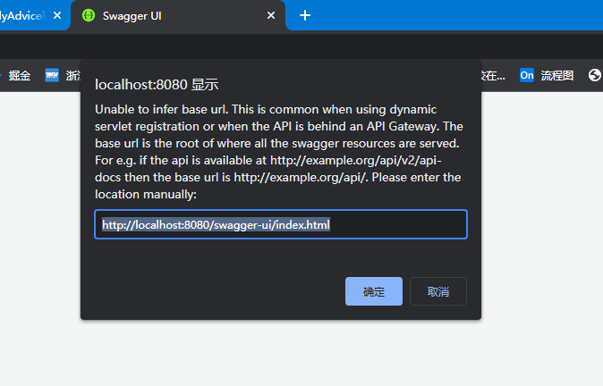
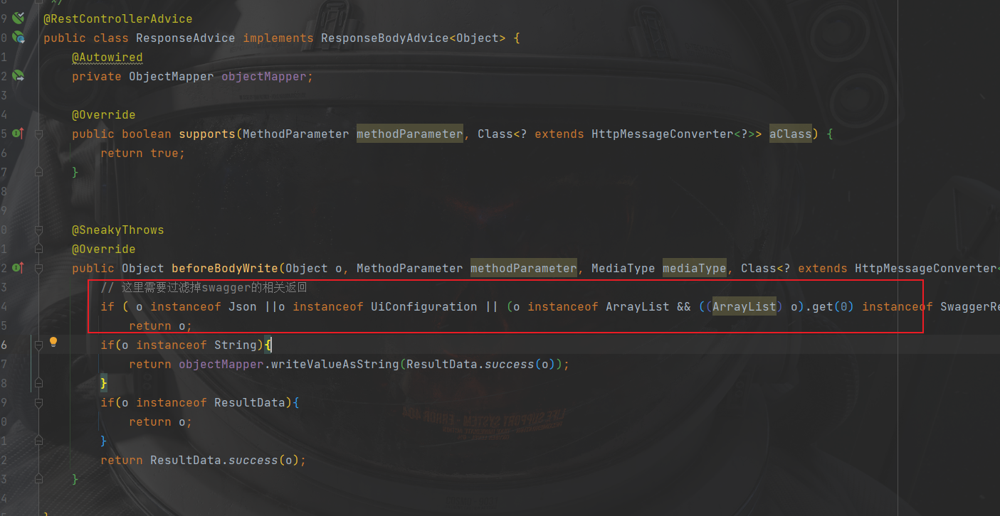
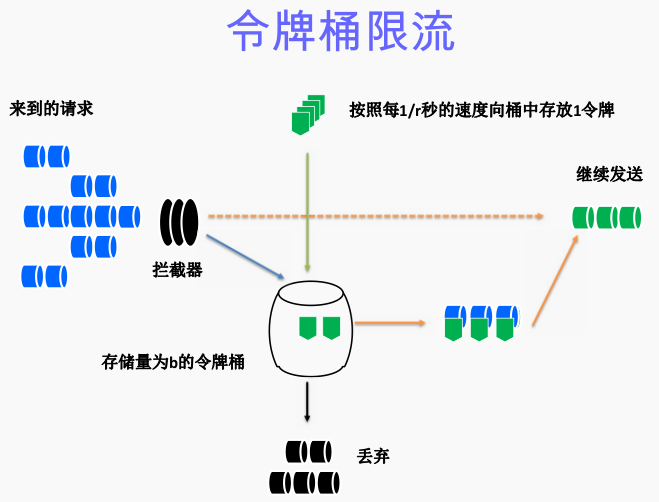
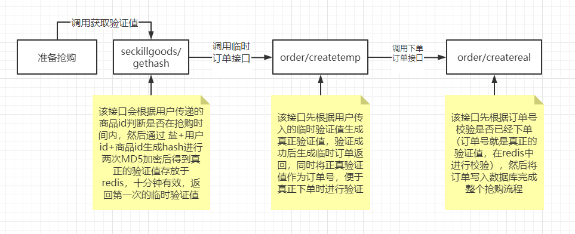

# seckill
银行秒杀系统开发记录
## 2021-11-29

完成了秒杀系统登录功能，采用AOP监控登陆状态（LonginAspect）,使用Validation API进行参数校验，通过自定义切面实现监控，但是要注意去掉秒杀部分的监控，在秒杀的那一小段时间里去除所有不必要的开销


通过reids实现分布式登录,实现session一致性，采用后端统一存储的方式，实现分布式登录可以为了以后如果有集群搭建的需求做准备。


## 2022-1-12

统一接口返回和全局异常处理,规定将所有错误信息统一以异常抛出，示例：https://juejin.cn/post/6986800656950493214


## 2022-1-13

新增秒杀订单表，秒杀商品表，通过乐观锁实现下单防止超卖


## 2022-1-14

导入swagger，选用swagger3，比之前的2更加简单，引入依赖即可，并通过Swagger3Config类进行配置

```yml
implementation group: 'io.springfox', name: 'springfox-boot-starter', version: '3.0.0'
```

引入依赖后需要解决之前配置的@RestControllerAdvice和swagger的冲突，直接使用会导致swagger返回的结果被@RestControllerAdvice封装，页面会跳出如下提示



进行配置将swagger结果直接返回即可,具体操作：https://juejin.cn/post/6921700441038258189



在面临高并发的请购请求时，如果不对接口进行限流，可能会对后台系统造成极大的压力。尤其是对于下单的接口，过多的请求打到数据库会对系统的稳定性造成影响。同时有人用软件恶意刷单抢货，需要限流防止机器参与活动，所以需要对接口进行限流。这里在之前讲过的乐观锁抢购接口上增加该令牌桶限流。

```apl
令牌桶算法最初来源于计算机网络。在网络传输数据时，为了防止网络拥塞，需限制流出网络的流量，使流量以比较均匀的速度向外发送。令牌桶算法就实现了这个功能，可控制发送到网络上数据的数目，并允许突发数据的发送。

大小固定的令牌桶可自行以恒定的速率源源不断地产生令牌。如果令牌不被消耗，或者被消耗的速度小于产生的速度，令牌就会不断地增多，直到把桶填满。后面再产生的令牌就会从桶中溢出。最后桶中可以保存的最大令牌数永远不会超过桶的大小。
```



先引入Google的guava依赖，其内包含令牌桶算法

```yml
    implementation group: 'com.google.guava', name: 'guava', version: '30.1.1-jre'
```

在下单接口加上令牌桶限流

```java
 //每秒放行100个请求
    RateLimiter rateLimiter = RateLimiter.create(100);

    @PostMapping("/create")
    @Operation(summary = "用户下单")
    public TOrderRecord createWrongOrder(String dataid) throws Exception {
        //非阻塞式获取令牌：请求进来后，若令牌桶里没有足够的令牌，会尝试等待设置好的时间（这里写了1000ms），其会自动判断在1000ms后，
        //这个请求能不能拿到令牌，如果不能拿到，直接返回抢购失败。如果timeout设置为0，则等于阻塞时获取令牌。
        if (!rateLimiter.tryAcquire(1000, TimeUnit.MILLISECONDS))
            throw new RuntimeException("抢购失败，限流");
        TOrderRecord tOrderRecord = tOrderRecordService.createOrder(dataid);
        return tOrderRecord;
    }
```

由于需求是支付成功后减少库存，所以将下单接口拆分，变为createTempOrder和createRealOrder两个方法，第一个方法用于在用户点击下单时生成临时订单返回给用户（不写入数据库），在用户成功付款后（点击确认支付按钮时）调用第二个方法将订单写入数据库表示抢购成功，两个方法调用时都会先检查销售数量。

## 2022-1-15

为了防止脚本抢购秒杀商品等行为，需要将接口隐藏，抢购接口隐藏（接口加盐）的具体做法：

- 每次点击秒杀按钮，先从服务器获取一个秒杀验证值（接口内判断是否到秒杀时间等操作）。
- Redis以缓存用户ID和商品ID为Key，验证值为Value缓存验证值
- 用户请求秒杀商品的时候，带上秒杀验证值，得到一个临时订单数据
- 在临时订单支付时进行校验，完成下单写入数据库

由于业务需求将下单接口拆分后需要确保用户抢购时要按流程走过所有接口，从获取验证时-->获取临时订单-->真正下单，所以在获取验证值时程序会将用户id和商品id配合上盐（防止加密太简单被直接猜到）进行两次MD5加密后存入redis，并返回第一次加密后的值。

```java
 // 盐+用户id+商品id生成hash进行第一次MD5加密，用于临时订单接口生成真正的校验码
String verify = CacheKey.SALT_KEY.getKey() + user.getUserId() + dataId;
String verifyHash = DigestUtils.md5DigestAsHex(verify.getBytes());

//第二次加密，用于真正下单支付时校验
String verify2 = CacheKey.SEC_SALT_KEY.getKey() + verifyHash;
String verifyHash2 = DigestUtils.md5DigestAsHex(verify2.getBytes());

// 将第二次加密后的存入redis
String hashKey = CacheKey.VERIFY_KEY.getKey() + "_" + user.getUserId() + "_" + dataId;
redisTemplate.opsForValue().set(hashKey, verifyHash2, 600, TimeUnit.SECONDS);

//返回第一次加密的verifyHash
return verifyHash;
```

验证值获取后开始进行第二步获取临时订单，在这一步的时候会将传入验证值（第一次加密后的值）进行与第一步操作（获取验证值）的第二次加密一样的操作，从而获得真正的验证值（也就是在redis中存储的值），然后在生成订单时把这个值作为订单号返回。（把这个真正的验证值作为订单号的一个好处是这个值是个一个用户+一个商品所对应的，一般情况下秒杀商品是限购一份的，也就是说根据订单号唯一性（数据库设置该字段不可重复）可以保证每个用户限购一份相同的商品）

```java
//将临时VerifyHash再进行MD5加密生成真正的校验码作为订单号填入用于支付时校验
String verify = CacheKey.SEC_SALT_KEY.getKey() + params.getVerifyHash();
String verifyHash = DigestUtils.md5DigestAsHex(verify.getBytes());
order.setOrderId(verifyHash);
```

在第三步时会先对订单号进行校验，校验操作就是根据key查询redis中是否有这个订单号，成功后再进行后续操作。

**进行两次加密的原因：**如果只进行一次加密的话在第一步返回后redis中存储的就是最后的验证值，如果有人把接口都拿到的话可以直接进行第一步拿到验证值然后跳过第二步，进行第三步直接支付下单是可以通过验证的，但如果是两次MD5加密的话就必须依次经过这三个接口。

现阶段的下单大体流程如下：



