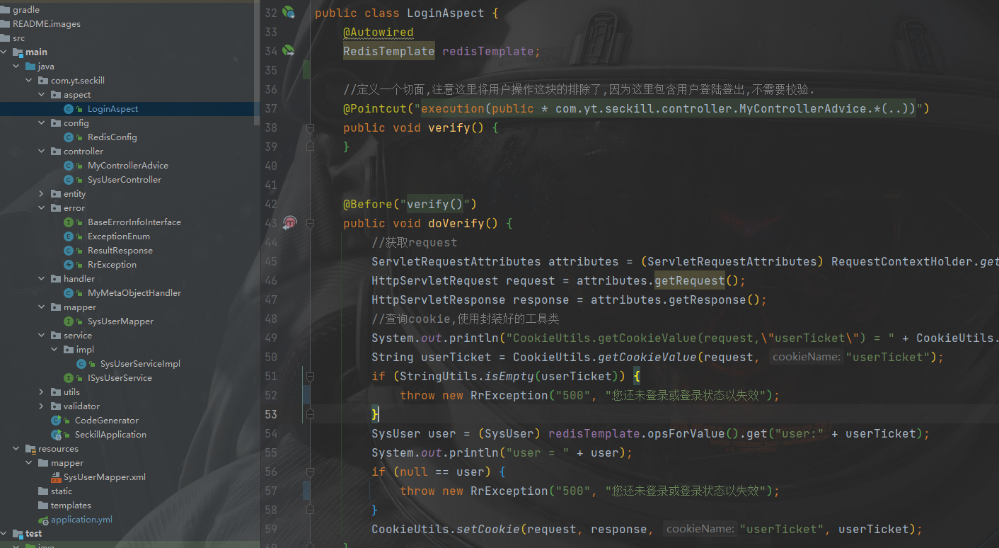
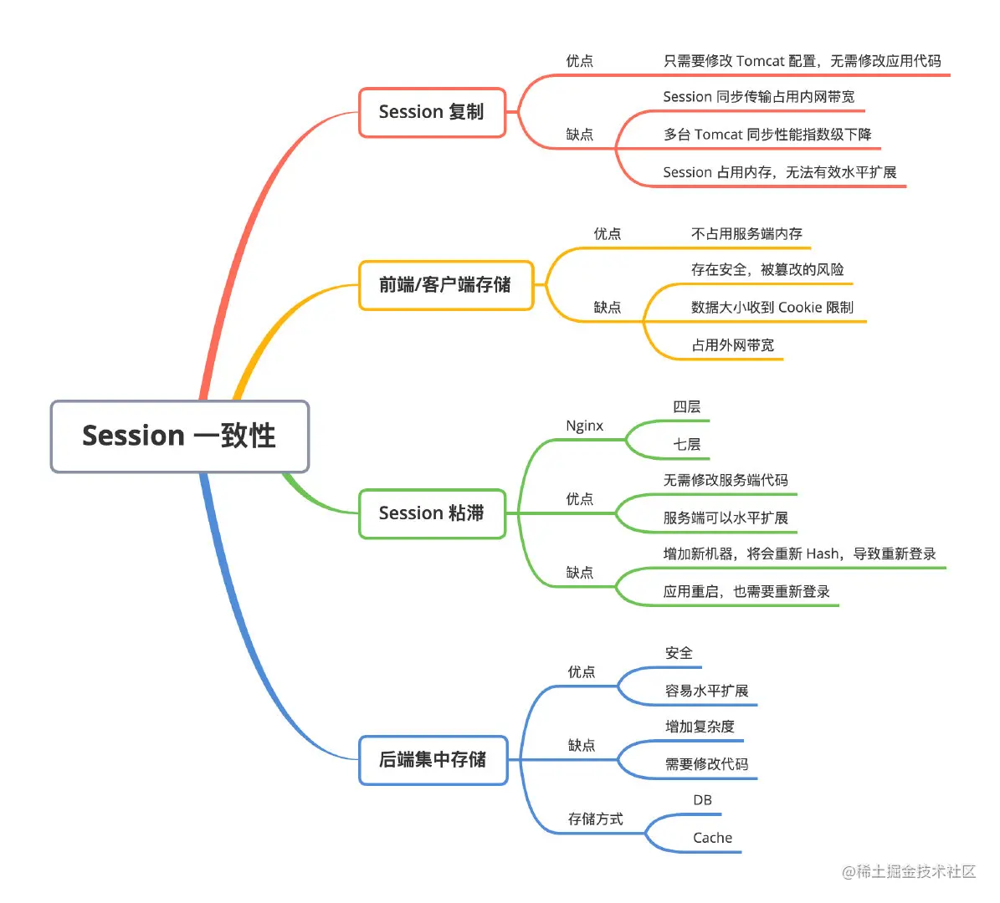
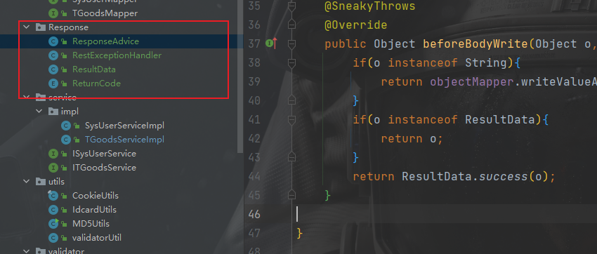
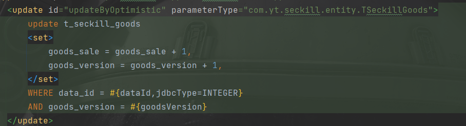

# seckill
银行秒杀系统开发记录
## 2021-11-29

完成了秒杀系统登录功能，采用AOP监控登陆状态（LonginAspect），通过自定义切面实现监控，但是要注意去掉秒杀部分的监控，在秒杀的那一小段时间里去除所有不必要的开销

通过reids实现分布式登录,实现session一致性，采用后端统一存储的方式，实现分布式登录可以为了以后如果有集群搭建的需求做准备。

## 2022-1-12

统一接口返回和全局异常处理,示例：https://juejin.cn/post/6986800656950493214

## 2022-1-13

新增秒杀订单表，秒杀商品表，通过乐观锁实现下单防止超卖

